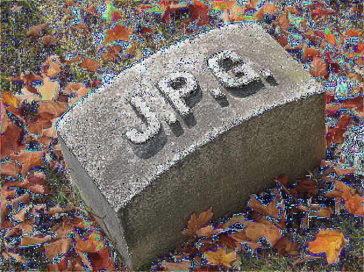

# PS4 — Image Processing Educational Project

This repository contains an **educational image-processing project** created as part of a university assignment.  
The goal is to **implement common image-processing operations manually**, using only core Python and **NumPy**, without relying on external image-processing libraries like OpenCV.

The project demonstrates how classical image transformations work internally: convolution, filtering, edge detection, pixel-wise operations, gamma correction, and more.

---

## ✨ Features

### **1. Arithmetic Operations**
- Add  
- Subtract  
- Multiply  
- Divide
- Gamma correction

These operate pixel-by-pixel with clipping to the valid range (0–255).

---

### **2. Grayscale Conversion**
Implemented in several modes:
- Standard grayscale  
- Per-channel grayscale (R / G / B weighted)

---

### **3. Image Enhancement Filters**
- **Mean (averaging) filter**  
- **Median filter**  
- **Gaussian blur**  
- **Sharpen filter**

Each filter is implemented using **manual convolution via NumPy**, without external helper libraries.

---

### **4. Sobel Edge Detection**
Supports Sobel masks at:
- **0°**
- **45°**
- **90°**
- **135°**

Multiple angles can be combined.  
Only four kernels are needed — the remaining ones are 180° rotations differing only by sign.

---

### **5. Custom Convolution**
The user can apply a **custom kernel of any valid odd size**  
(e.g., 3×3, 5×5, 7×7…).

---
## ▶️ Running the Project

Run the demo script:
```bash
python Examples.py
```

---

## 🖼 Example Results

### Input Image  
`input/example.jpg`  


---

### Example Outputs

#### Median Filter  
`output/examples/median.jpg`  


#### Gaussian Blur  
`output/examples/gaussian.jpg`  


#### Sharpen Filter  
`output/examples/sharpen.jpg`  


#### Sobel (0°, 45°, 90°, 135° combined)  
`output/examples/sobel_all.jpg`  


#### Arithmetic: Add  
`output/examples/add.jpg`  


## 🧩 Dependencies

Only:
- numpy
- Pillow

The project intentionally avoids OpenCV or SciPy to preserve the educational nature.

## 🎓 Purpose
This project is designed to help understand:
- how convolution works step-by-step
- how filters modify pixel matrices
- how Sobel detects gradients
- how pixel-wise operations affect brightness and contrast
- how grayscale transforms can be implemented manually

It is not a production-ready image-processing library — but a clear and well-structured educational implementation.

## 📜 License

This project is licensed under the **MIT License**.  
You are free to use, modify, and distribute this code for educational or personal purposes.

See the full license text in the [LICENSE](LICENSE) file.
